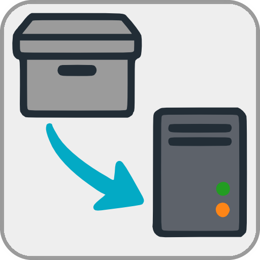

Migration Assistant
====
%3D'plugin'%20and%20%40name%3D'MigrationAssistant'%5D%2F%40minTarget&prefix=v&label=Min.%20LMS%20Version%20Required&color=darkgreen) 

**Migration Assistant (MIGA)** creates a portable backup of your Lyrion Music Server (LMS) configuration and lets you selectively restore it on the same or a new installation. It's meant for anyone moving LMS to new hardware, a new OS or a fresh install, without having to manually reconfigure everything from scratch. 

<a href="https://github.com/AF-1/">⬅️ <b>Back to the list of all plugins</b></a>
  

> [!IMPORTANT]
> **Before using this plugin, please create your own backup of all relevant files.** Migration Assistant is provided "as is" - use at your own risk. 
> If you use [Ratings Light](https://github.com/AF-1/lms-ratingslight) and/or [Alternative Play Count](https://github.com/AF-1/lms-alternativeplaycount), please also create their own plugin backups before migrating - see below for why.

  

## Backup

A backup archive includes:

- LMS server preferences and all installed plugins' preferences  
- a small selection of per-track values: date added, play count, last played (LMS values, not APC)  
- your playlist folder (recursively, including subfolders), split into media playlists and other files  
- OPML/Favorites files  
- `log.conf` - logging settings  
- the Graphics, HTML, and IR custom folders  
- any additional custom folders you specify (e.g. a plugin's data folder), with a configurable target path for restoring to a different location  
- the data folders of the plugins Alternative Play Count, Custom Skip, Dynamic Playlists, Dynamic Playlist Creator, Ratings Light and Virtual Library Creator

 

**Not included, on purpose:**

- **`library.db` and `persist.db`** - these aren't backed up. They're large and there's no need: `library.db` is rebuilt correctly by the rescan that follows a fresh install or a restore anyway and the per-track values Migration Assistant does carry over (date added, play count, date last played) are restored directly into `persist.db`. Ratings, extended play count data and play history are better restored through the backup/restore features of Ratings Light and Alternative Play Count, which is why I recommend backing those up separately beforehand.  
- **Protected system folders** - the LMS preferences folder, cache folder, Plugins folder and your configured media library folders can't be added as custom backup paths, since backing them up this way could conflict with, duplicate or corrupt data that's already handled elsewhere.  
- **Folders that duplicate a plugin's own data folder** - if a custom path you enter matches a data folder already covered automatically (see list above), it's skipped to avoid backing it up twice.

  

## Restore

**Restoring onto a freshly installed server?** Install LMS first and complete the setup wizard, setting your media folder path(s) and playlist folder path. Wait until the initial library scan has **fully** completed. Only then install the plugins you want to use - and only after that, continue with the steps below.

1. During the restoration process, do not play any songs or modify any settings, as they will remain read-only until the server restarts.  
2. Point Migration Assistant at a previously created backup archive.  
2. Preview its contents and choose exactly which items to restore - nothing is restored automatically or all-or-nothing.  
3. **Immediately after the restore is complete, the server must be restarted. This is mandatory.** If anything you restored requires a *rescan*, you will be notified after the restore completes and must trigger the rescan manually **after restarting the server**.

   

## Installation

- Add the repository URL below at the bottom of `LMS > Settings > Plugins` and click *Apply*: 
[https://raw.githubusercontent.com/AF-1/sobras/main/repos/lmsghonly/public.xml](https://raw.githubusercontent.com/AF-1/sobras/main/repos/lmsghonly/public.xml)

- Install the plugin from the added repository at the bottom of the page.

    

## Report a new issue

To report a new issue please file a GitHub [**issue report**](https://github.com/AF-1/lms-migrationassistant/issues/new/choose).
   

---

If this project was useful to you, you can star the repository using the  button in the top-right corner of this page.
   
